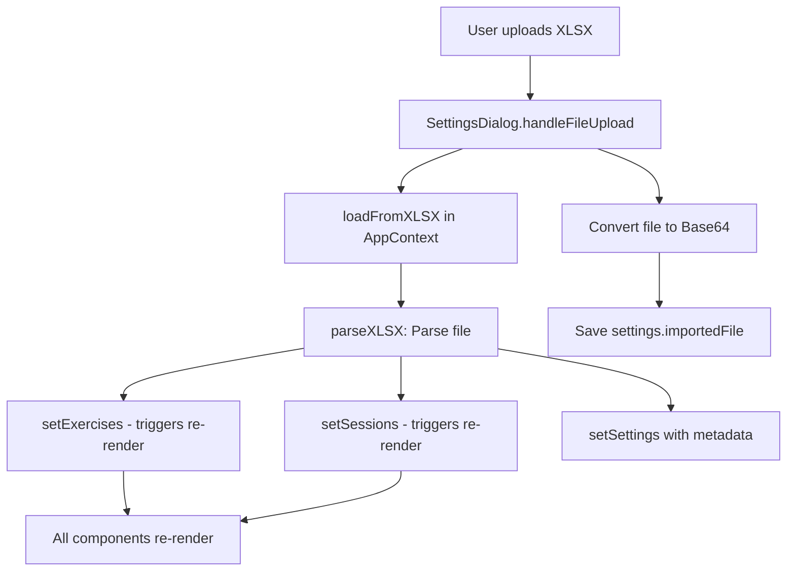
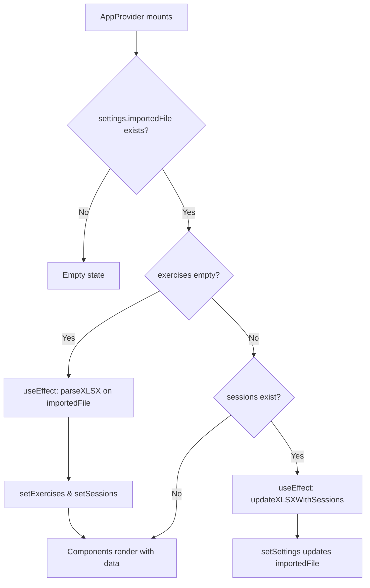
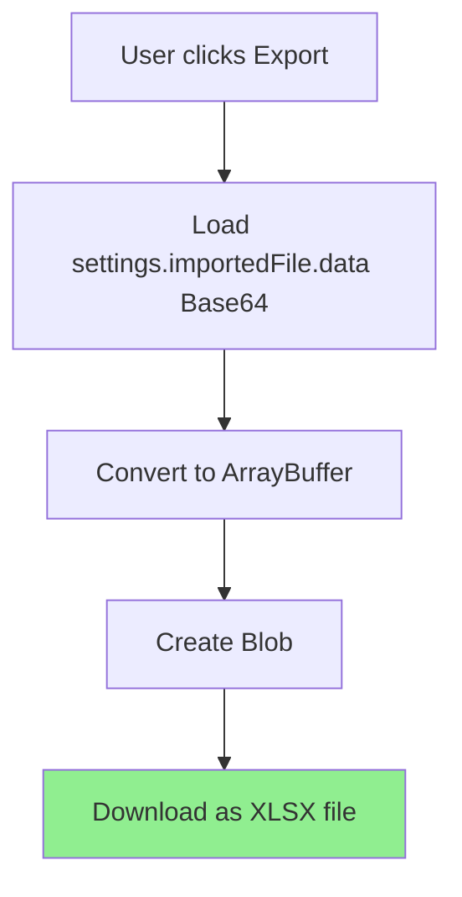
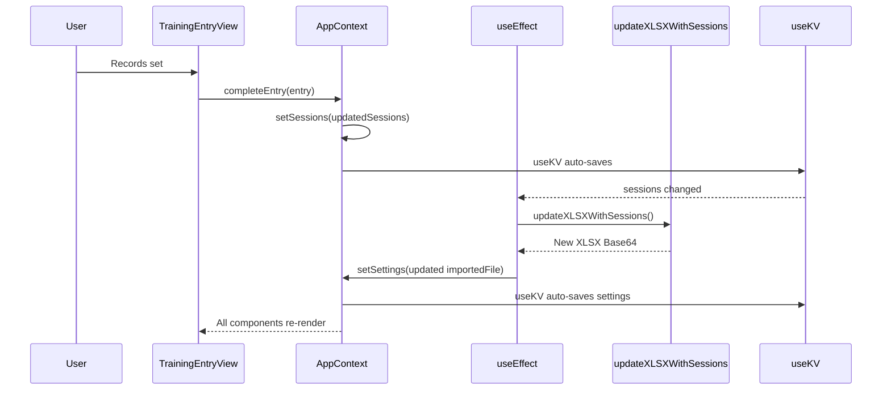

# Data Flow Architecture - Hill Fitness Sheets

## ✅ React Context Architecture (Updated)

**All app state is now managed through `AppContext`**, providing a centralized, reactive data layer with automatic re-renders across all components.

## Architecture Pattern

```
main.tsx → AppProvider
    ↓
AppContext (exercises, sessions, settings)
    ↓
Components use: useApp() hook
```

### Benefits
- **Single source of truth**: All data in one context
- **Automatic re-renders**: State changes propagate instantly
- **No prop drilling**: Direct context access
- **Persistent storage**: useKV provides localStorage sync
- **Offline-first**: Changes persist automatically

## Data Flow

### 1. Import (XLSX → App)



### 2. Auto-Load on Startup



### 3. Recording Training

```mermaid
flowchart TBcompletes workout] --> C2[TrainingEntryView.onComplete]
    C2 --> C3[completeEntry in AppContext]
    C3 --> C4[setSessions updates state]
    C4 --> C5[useEffect detects sessions change]
    C5 --> C6[updateXLSXWithSessions auto-runs]
    C6 --> C7[setSettings updates importedFile]
    C4 --> C8[All components re-render with new session]
    C7 --> C8[Save sessions to useKV]
```

### 4. Export



**Note:** The exported XLSX contains an additional **"History" Sheet** with all training data in tabular form (Date | Exercise | Weight | Reps | Set).
Component Data Access

Components access data via the `useApp()` hook:

```tsx
import { useApp } from '@/contexts/AppContext'

function MyComponent() {
  const { exercises, sessions, settings, completeEntry } = useApp()
  
  // All data is reactive - changes trigger re-renders
  return <div>{exercises.length} exercises</div>
}
```

### Component Hierarchy

```
AppProvider [provides context]
└─ App.tsx [consumes: exercises, sessions, settings, completeEntry, updateEntry]
   ├─ SessionHeader [props: session, allSessions]
   ├─ SettingsDialog [consumes: settings, setSettings, loadFromXLSX]
   ├─ ExerciseList [props: exercises, currentSession, allSessions]
   └─ TrainingEntryView [props: exercise, currentSession, allSessions]
```

## 
## useKV Keys Used

| Key | Type | Description |
|-----|-----|--------------|
| `settings` | AppSettings | Contains defaultSetsPerExercise + **importedFile** (Base64 XLSX) + Metadata (trainingGoal, legalNotice, notes) |
| `exercises` | Exercise[] | List of all exercises (parsed from XLSX) |
| `sessions` | Session[] | All training sessions with sets (synchronized to XLSX) |

## Core Functions (lib/utils.ts)

## Synchronization Flow

**Context-driven automatic sync:**



## Key Implementation Files

- **[AppContext.tsx](src/contexts/AppContext.tsx)**: Central state + business logic
- **[App.tsx](src/App.tsx)**: Main app shell
- **[SettingsDialog.tsx](src/components/SettingsDialog.tsx)**: Import/export UI
- **[utils.ts](src/lib/utils.ts)**: XLSX parsing/writing
- **[types.ts](src/lib/types.ts)**: TypeScript definitions

## Architecture Benefits

✅ **Centralized state**: All data in AppContext  
✅ **Automatic re-renders**: Context propagates changes instantly  
✅ **No prop drilling**: Direct context access via useApp()  
✅ **Offline-capable**: All data in useKV/localStorage  
✅ **Single Source of Truth**: XLSX in localStorage  
✅ **Persistence**: Data survives reload  
✅ **Export anytime**: Current XLSX downloadable  

## Data Flow Diagram (Updated)

```mermaid
graph TB
    subgraph Context["AppContext (React Context)"]
        STATE["Context State:<br/>exercises, sessions, settings"]
    end
    
    subgraph Storage["useKV (localStorage)"]
        XLSX["settings.importedFile<br/>(Base64 XLSX + History Sheet)<br/>⭐ Single Source of Truth"]
        META["settings.metadata<br/>(trainingGoal, legalNotice, notes)"]
        EX["exercises<br/>(parsed)"]
        SESS["sessions<br/>(parsed + runtime updates)"]
    end
    
    STATE -->|auto-sync| EX
    STATE -->|auto-sync| SESS
    STATE -->|auto-sync| XLSX
    
    EX -->|useKV| STATE
    SESS -->|useKV| STATE
    XLSX -->|useKV| STATE
    
    SESS -->|useEffect triggers| XLSX
    
    style STATE fill:#4a9eff,stroke:#333,stroke-width:3px,color:#fff
    style XLSX fill:#ff8c42,stroke:#333,stroke-width:3px,color:#000
    style Context fill:#1a1a1a,stroke:#666,stroke-width:2px
    style Storage fill:#2a2a2a,stroke:#666,stroke-width:2px
```



## Synchronization*Offline-capable**: All data in useKV/localStorage  
✅ **Single Source of Truth**: XLSX in localStorage  
✅ **Persistence**: Data survives reload  
✅ **Export anytime**: Current XLSX can be exported  
✅ **No duplication**: One central parseXLSX function  
✅ **Automatic loading**: XLSX loaded automatically on startup

## Data Flow Diagram

```mermaid
graph TB
    subgraph Storage["useKV (localStorage)"]
        XLSX["settings.importedFile<br/>(Base64 XLSX + History Sheet)<br/>⭐ Single Source of Truth"]
        META["settings.metadata<br/>(trainingGoal, legalNotice, notes)"]
        EX["exercises<br/>(parsed)"]
        SESS["sessions<br/>(parsed + runtime updates)"]
        
        XLSX -->|parseXLSX read| EX
        XLSX -->|parseXLSX read| META
        XLSX -->|parseXLSX read| SESS
        SESS -->|updateXLSXWithSessions write| XLSX
    end
    
    style XLSX fill:#ff8c42,stroke:#333,stroke-width:3px,color:#000
    style SESS fill:#4a9eff,stroke:#333,stroke-width:2px,color:#fff
    style Storage fill:#2a2a2a,stroke:#666,stroke-width:2px
```


