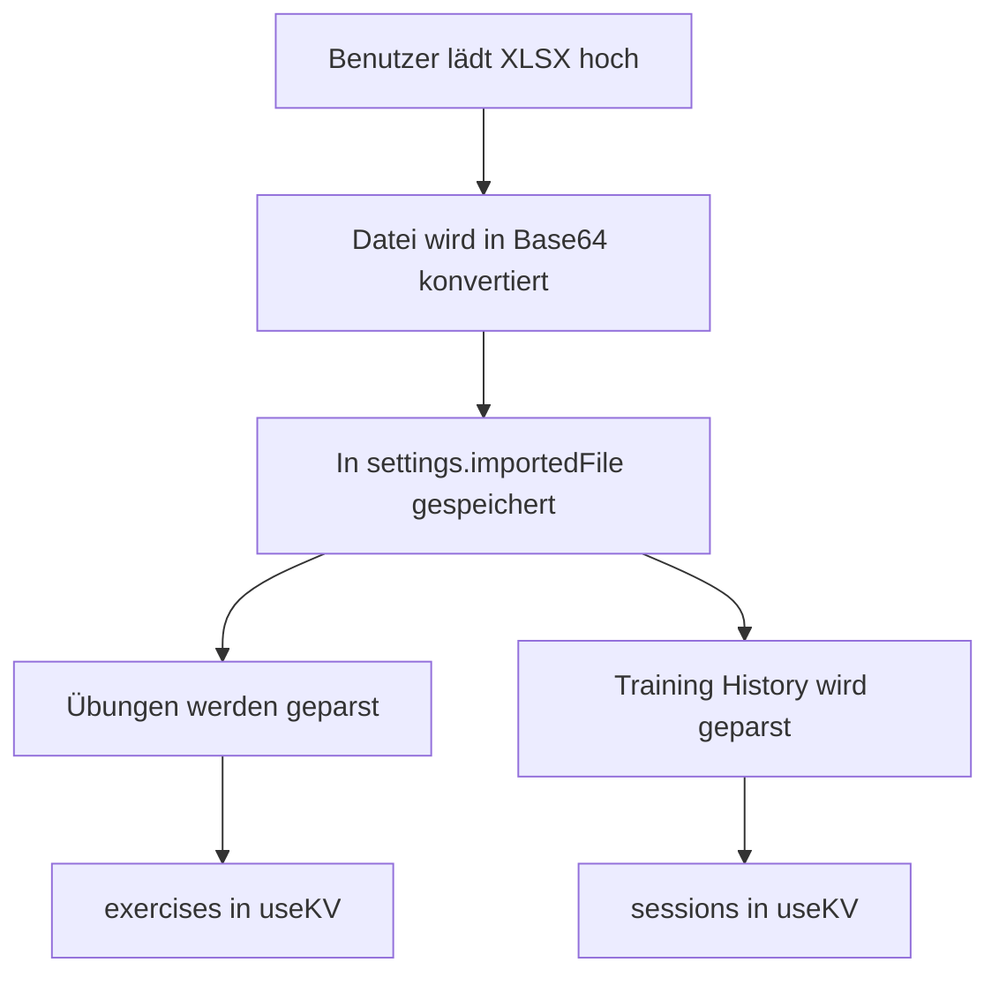
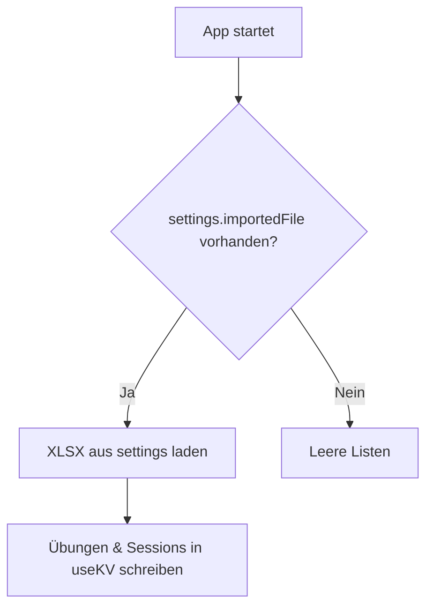
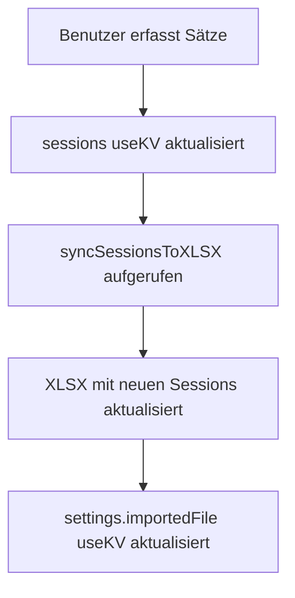
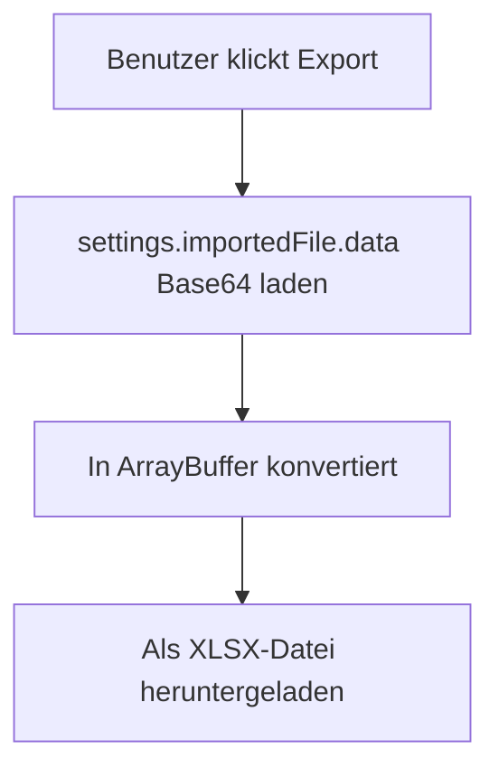
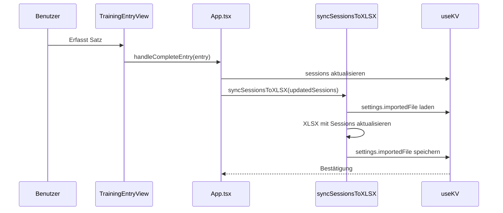

# Datenhaltung - Gym Tracker

## ✅ Single Source of Truth

Die XLSX-Datei im Local Storage (useKV) ist die **Single Source of Truth** für alle Daten.

## Datenfluss

### 1. Import (XLSX → App)

### 2. Auto-Load beim Start

### 3. Training erfassen

### 4. Export

## Verwendete useKV Keys

| Key | Typ | Beschreibung |
|-----|-----|--------------|
| `settings` | AppSettings | Enthält defaultSetsPerExercise + **importedFile** (Base64 XLSX) |
| `exercises` | Exercise[] | Liste aller Übungen (aus XLSX geparst) |
| `sessions` | Session[] | Alle Trainingssessions mit Sets (wird in XLSX synchronisiert) |

## Zentrale Funktionen (lib/utils.ts)

### parseXLSX(arrayBuffer)
- Liest XLSX-Datei
- Extrahiert Übungen, Metadata, Sessions
- Returns: `{ exercises, metadata, sessions }`

### updateXLSXWithSessions(xlsxData, sessions, exercises)
- Nimmt aktuelle XLSX-Daten (Base64)
- Aktualisiert "Training History" Sheet mit sessions
- Returns: neue XLSX-Daten (Base64)

### base64ToArrayBuffer(base64)
- Konvertiert Base64 → ArrayBuffer

### arrayBufferToBase64(buffer)
- Konvertiert ArrayBuffer → Base64

## Synchronisation

**Wann wird die XLSX aktualisiert?**
1. Bei jedem Abschluss einer Übung (handleCompleteEntry)
2. Bei jeder Änderung an Sets (handleUpdateEntry)
3. Beim Löschen von Sets

## Vorteile dieser Architektur

✅ **Offline-fähig**: Alle Daten in useKV/localStorage  
✅ **Single Source of Truth**: XLSX im localStorage  
✅ **Persistenz**: Daten überleben Neuladen  
✅ **Export jederzeit**: Aktuelle XLSX kann exportiert werden  
✅ **Keine Duplikation**: Eine zentrale parseXLSX Funktion  
✅ **Automatisches Laden**: Beim Start wird XLSX automatisch geladen

## Datenfluss-Diagramm

```mermaid
graph TB
    subgraph Storage["useKV (localStorage)"]
        XLSX["settings.importedFile<br/>(Base64 XLSX)<br/>⭐ Single Source of Truth"]
        EX["exercises<br/>(parsed)"]
        SESS["sessions<br/>(parsed + updates)"]
        
        XLSX <-->|parseXLSX| EX
        XLSX <-->|parseXLSX<br/>updateXLSXWithSessions| SESS
    end
    
    style XLSX fill:#ff8c42,stroke:#333,stroke-width:3px,color:#000
    style Storage fill:#2a2a2a,stroke:#666,stroke-width:2px
```

