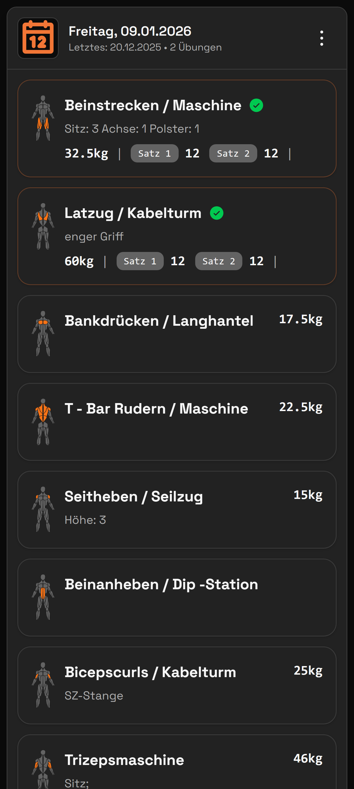
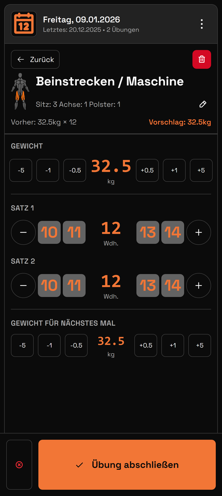
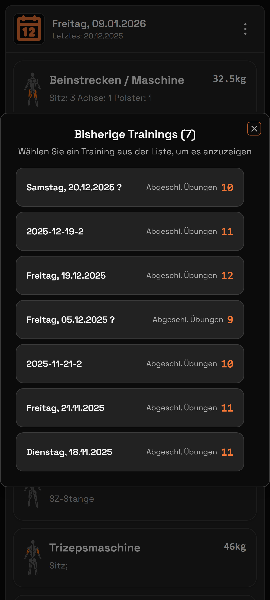
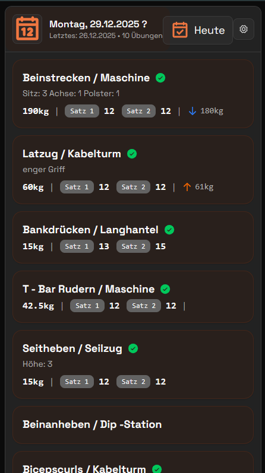
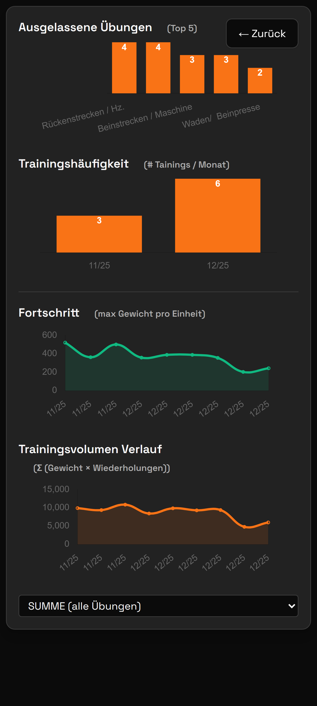

# Hill Fitness Sheets

Eine Progressive Web App zum Tracken von Trainingseinheiten im Fitnessstudio mit Offline-Funktionalität.

## Für Benutzer

**Hill Fitness Sheets** ist deine persönliche Trainings-App, die entwickelt wurde, um schnell und einfach während des Workouts Sätze, Gewichte und Wiederholungen zu erfassen. Die App funktioniert komplett offline und synchronisiert deine Daten optional mit Excel/Google Sheets.

### Screenshots

#### Übungen-Übersicht

*Wähle deine Übung aus der Liste. Die Übungen ohne grünen Haken sind heute noch zu absolvieren.

#### Training erfassen

*Erfasse deine Sätze mit großen, gut touchbaren +/- Buttons. Gewicht und Wiederholungen können schnell angepasst werden. Die vorherigen Werte werden zur Orientierung angezeigt (grüner Pfeil zeigt Steigerung, roter Pfeil zeigt Reduzierung).*

#### Trainingshistorie

*Sieh dir deine vergangenen Trainingseinheiten an. Jede Übung zeigt die erfassten Sätze mit Gewicht und Wiederholungen.*

*Detaillierte Ansicht einer abgeschlossenen Trainingseinheit mit allen erfassten Übungen und Werten.*

#### Einstellungen & Versionierung

*In den Einstellungen findest du die App-Version (1.0.X mit Git-Hash), Import/Export-Funktionen für Excel-Dateien und die Möglichkeit, den App-Cache zu leeren. Die App prüft automatisch auf neue Versionen und bietet dir an, diese zu installieren.*

#### Statistiken

*Verfolge deinen Trainingsfortschritt mit detaillierten Statistiken und Diagrammen. Sieh auf einen Blick, wie sich deine Leistung über die Zeit entwickelt.*

### Was macht die App besonders?

- **🚀 Schnelle Eingabe**: Große Touch-Targets und +/- Buttons für blitzschnelles Erfassen während des Trainings
- **📴 Offline-fähig**: Funktioniert komplett ohne Internetverbindung – perfekt fürs Gym
- **📊 Fortschritts-Tracking**: Sieh auf einen Blick, ob du dich gesteigert hast (grüne/rote Pfeile)
- **💾 Excel-Sync**: Importiere Übungen aus Excel und exportiere deine Trainings-Daten
- **🌙 Dark Mode**: Augenschonendes dunkles Design mit orangen Akzenten
- **📱 PWA**: Installierbar auf Smartphone, Tablet und Desktop
  

 

---

Entwickler/Developer: [DEV_README.md](DEV_README.md)
